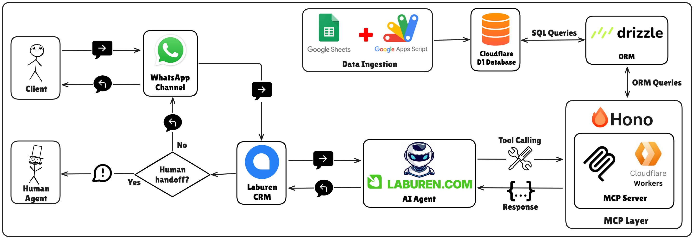
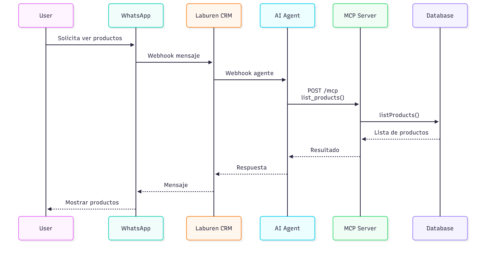
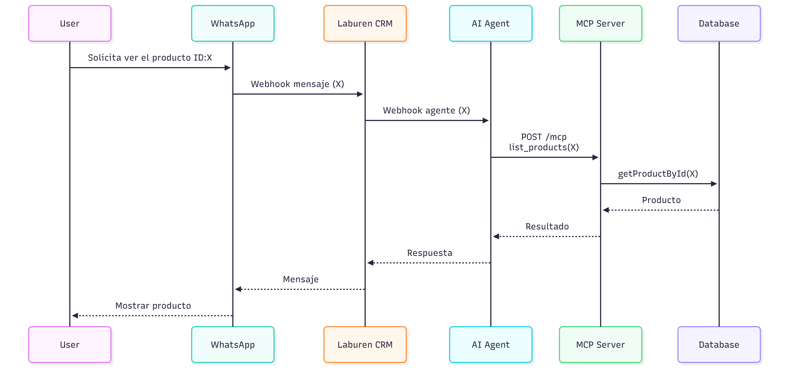
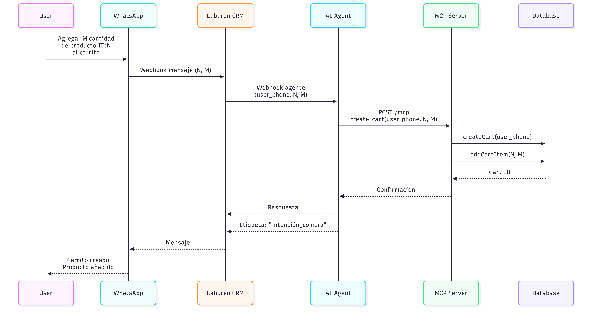
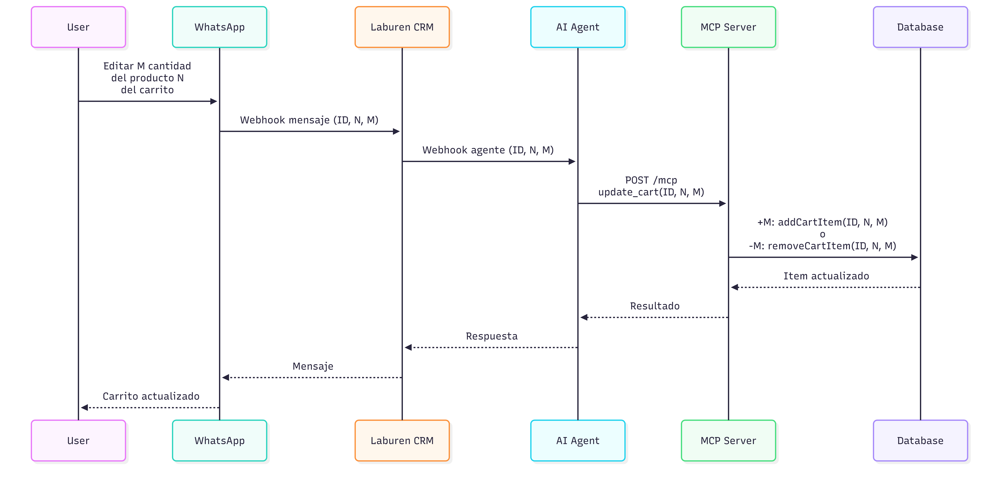
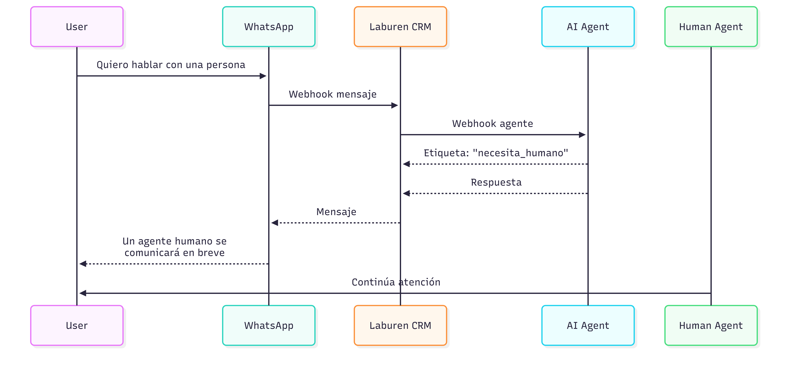
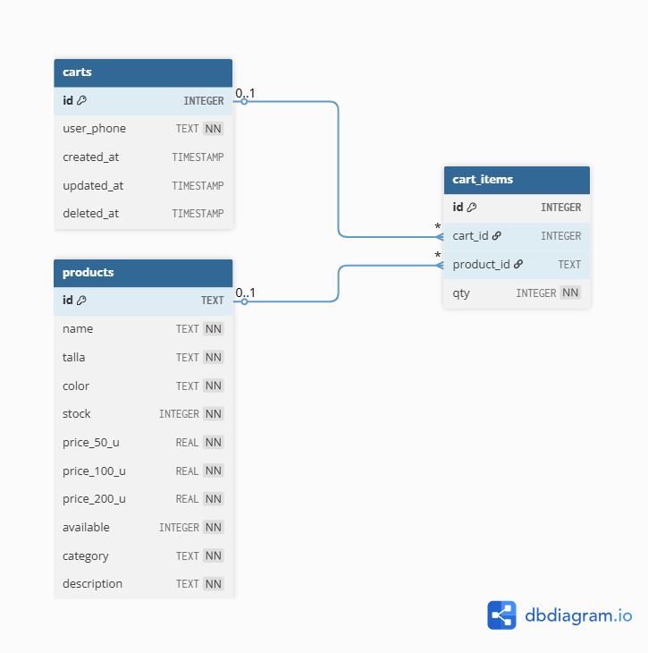
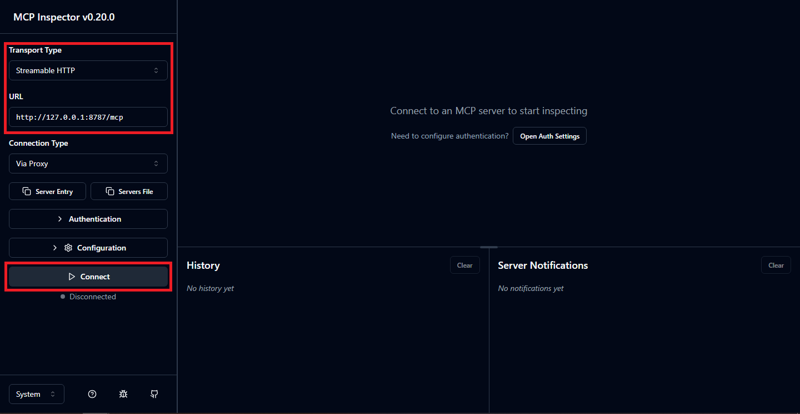

# Laburen MCP Server

<div align="center">


</div>

## Descripción

Servidor MCP (Model Context Protocol) sobre Cloudflare Workers + Hono con base de datos D1 (SQLite). Expone un endpoint HTTP para herramientas MCP orientadas a productos, carritos e items de carrito.

* [Link al Despliegue en Cloudflare Workers](https://laburen-mcp.marianoinsaurralde5.workers.dev/)
* [Link al Agente en WhatsApp](https://wa.me/+5493625483155)
* Número del Agente: +54 9 362 548-3155

## Caracteristicas

- Servidor MCP con herramientas listas para agentes.
- Base de datos D1 (SQLite) con Drizzle ORM.
- Health check simple en `GET /`.
- Deploy y desarrollo con Wrangler.

## Tecnologías

- Node.js 20+
- Hono.js
- @modelcontextprotocol/sdk + @hono/mcp
- Drizzle ORM
- Cloudflare Wrangler
- Cloudflare Workers
- Cloudflare D1

## Estructura

```
└── 📁laburen-mcp
    ├── 📁docs              # Diagrama(s) & documento conceptual
    ├── 📁prompts           # System Prompt para el Agent Bot en Laburen.com
    ├── 📁src
    ├────── 📁handlers      # Logica de dominio (DB)
    ├────── 📁schemas       # Esquemas Drizzle
    ├────── index.ts        # Worker principal
    ├────── mcp.ts          # Servidor MCP
    ├── schema.sql          # SQL base
```

## Arquitectura



La solución implementa una **arquitectura en capas con conversaciones mediadas por CRM y herramientas MCP serverless.**, organizada en capas desacopladas que se comunican mediante eventos de conversación y llamadas HTTP.

La **Channel Layer** (WhatsApp) envía los mensajes del usuario al **CRM Layer** (Chatwoot/Laburen) a través de webhooks, donde se mantiene el estado conversacional. 

El CRM transmite los eventos al **AI Agent Layer**, que interpreta la intención del usuario y decide las acciones a ejecutar. Cuando se requieren operaciones de negocio o acceso a datos, el agente invoca herramientas del **MCP Layer** mediante **HTTP/JSON-RPC**, desplegadas en infraestructura **serverless** (Cloudflare Workers). 

Estas herramientas interactúan con la **Data Layer** (Cloudflare D1) mediante consultas ORM, y las respuestas retornan en sentido inverso hasta el usuario, manteniendo la separación de responsabilidades y la escalabilidad de cada capa.

Adicionalmente, la arquitectura incorpora un **Data Ingestion Pipeline**, implementado mediante **Google Sheets y Google Apps Script**, encargado de la carga y sincronización inicial de productos hacia la base de datos. Este pipeline automatiza la transformación y envío de datos desde las hojas de cálculo hacia la **Data Layer**, permitiendo actualizar el catálogo de productos sin afectar la operación del agente ni las capas conversacionales.

---

# 🎯 Fase Conceptual · Diseño del Agente de IA

Diagramas de secuencia que ilustran cómo el agente atiende a un cliente que:

## 1. Explora productos



### 1.1. Búsqueda por producto específico (ID o Nombre)



## 2. Crea un carrito



## 3. (Extra) Edita el carrito si el usuario lo pide



## 4. (Extra) Necesita agente humano



---

# 💻 Fase Práctica · MCP & Base de Datos

## Requisitos

- Node.js 20+
- Cloudflare Wrangler CLI
- Base de datos Cloudflare D1 configurada

## Configuracion

1) Clonar el repositorio

```bash
git clone https://github.com/marianoInsa/laburen-mcp.git
```

2) Instalar dependencias:

```bash
cd laburen-mcp
npm install
```

3) Configurar Wrangler para D1 en `wrangler.jsonc`:

```jsonc
"d1_databases": [
  {
    "binding": "DB",
    "database_name": "laburen-challenge-db",
    "database_id": "<TU_DATABASE_ID>"
  }
]
```

4) Variables de entorno para Drizzle:

Crea un archivo `.env` con:

```bash
CLOUDFLARE_ACCOUNT_ID=...
CLOUDFLARE_DATABASE_ID=...
CLOUDFLARE_API_TOKEN=...
```

## Scripts

- `npx wrangler dev`: entorno de desarrollo local con Wrangler.
- `npx wrangler dev --remote`: entorno de desarrollo local con Wrangler + conexión a la instancia en la nube de Cloudflare D1.
- `npx wrangler deploy`: deploy del Worker.
- `npx vitest`: tests con Vitest.
- `npx wrangler types`: generar tipos de bindings.

## Endpoints

Base URL local: `http://localhost:8787`

### Health check

- `GET /`

Respuesta:

```json
{
  "status": "ok",
  "message": "Laburen · MCP Server Activo"
}
```

### MCP

- `POST /mcp`

El servidor MCP se conecta via `StreamableHTTPTransport` y registra herramientas para consumo por clientes MCP. La respuesta se entrega como `content` con texto JSON.

## MCP Tools

### `list_products`

Lista productos disponibles. Admite filtro por `product_id` o por `name`.

Input schema:

```json
{
  "product_id": "SKU-123",
  "name": "remera"
}
```

Salida: array de productos (o error en texto si no hay disponibles).

### `list_types_of_clothing`

Lista los tipos de indumentaria disponibles (valores unicos de `products.name`).

Input schema:

```json
{}
```

Salida: array con nombres unicos.

### `create_cart`

Crea un carrito y agrega el primer item.

> *Nota: reusa el carrito activo si existe.*

Input schema:

```json
{
  "user_phone": "+54 11 5555-0000",
  "product_id": "SKU-123",
  "qty": 2
}
```

Salida:

```json
{
  "cart_id": 1,
  "item": {"cart_id":1,"product_id":"SKU-123","qty":2}
}
```

### `update_cart`

Actualiza items del carrito segun `qty`:

- `qty > 0`: agrega unidades.
- `qty < 0`: quita unidades.

Input schema:

```json
{
  "cart_id": 1,
  "product_id": "SKU-123",
  "qty": -1
}
```

Salida: item actualizado o error (`PRODUCT_NOT_FOUND`, `CART_NOT_FOUND`, `INSUFFICIENT_STOCK`, `ITEM_NOT_FOUND`).

### `list_cart_items`

Lista items del carrito por `cart_id` o por `user_phone` (carrito activo).

Input schema:

```json
{
  "cart_id": 1,
  "user_phone": "+54 11 5555-0000"
}
```

Salida: array de items o error `CART_NOT_FOUND`.

## Modelo de datos



### products

- `id` (text, PK)
- `name` (text)
- `talla` (text)
- `color` (text)
- `stock` (integer)
- `price_50_u` (real)
- `price_100_u` (real)
- `price_200_u` (real)
- `available` (integer)
- `category` (text)
- `description` (text)

### carts

- `id` (integer, PK autoincrement)
- `user_phone` (text)
- `created_at` (text)
- `updated_at` (text)
- `deleted_at` (text, nullable)

### cart_items

- `id` (integer, PK autoincrement)
- `cart_id` (integer, FK -> carts)
- `product_id` (text, FK -> products)
- `qty` (integer)
- unique (`cart_id`, `product_id`)

## Desarrollo local

```bash
npx wrangler dev --remote
```

Wrangler levanta el Worker y expone el endpoint MCP. Para pruebas rapidas, puedes usar un cliente MCP compatible.

Se recomienda el uso de [@modelcontextprotocol/inspector](https://github.com/modelcontextprotocol/inspector).

### Uso del inspector

1. Iniciar el Inspector localmente

Abre una terminal y ejecuta el comando base sin argumentos adicionales:

```bash
npx @modelcontextprotocol/inspector@latest
```

Esto iniciará una interfaz web en `http://localhost:6274`.

2. Configurar la conexión remota

Una vez dentro de la interfaz del Inspector, ajusta los siguientes campos en el panel de configuración:

- **Transport Type:** Selecciona "Streamable HTTP".
- **URL:** Ingresa la URL de tu worker. Asegúrate de incluir el endpoint de MCP (`/mcp`): 
    - Servidor MCP Cloud: `https://laburen-mcp.marianoinsaurralde5.workers.dev/mcp`
    - Desarrollo Local:
        - Primero asegurate de iniciar en una consola el servidor MCP (npx wrangler dev --remote).
        - Luego, desde otra consola, inicia el inspector (comando de arriba).
        - La URL a colocar es: `http://localhost:8787/mcp`
- **Authorization (opcional):** Si tu worker requiere algún token de acceso, puedes añadirlo en la sección de headers como Authorization: Bearer <tu-token>.

3. Conectar y Probar
- Haz clic en el botón "Connect". Si la conexión es exitosa, verás:  *Status: "Connected"*.



4. Acciones sobre el servidor
- Tools: Una lista de todas las funciones definidas en el servidor.
- Ejecución: Podrás enviar parámetros a las tools y ver la respuesta JSON que devuelve el worker en tiempo real.

---

Proyecto desarrollado por **Mariano Insaurralde**.

---